  <html>
  <body>

  # **Ekip & Ürün Adı**

  ### **`CodeWise`**
  <table>
    <tr>
      <td>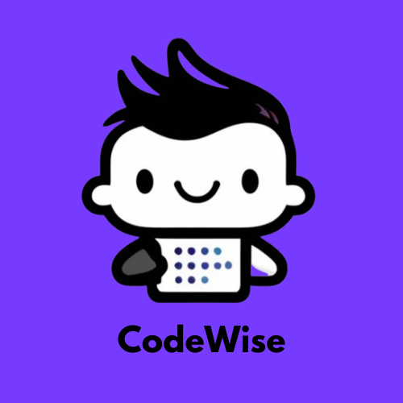</td>
    </tr>
  </table>
  

  # Ekip ve Ürün Hakkında Bilgiler

  ## Ekip Üyeleri

  <table>
    <tr>
      <th></th>
      <th>Name</th>
      <th>Title</th>
      <th>Socials</th>
    </tr>
    <tr>
      <td></td>
      <td>Adem Han</td>
      <td>Scrum Master</td>
      <td>
        
        
        
      </td>
    </tr>
    <tr>
      <td></td>
      <td>Nurdan Pehlivan</td>
      <td>Product Owner</td>
      <td>
        
        
      </td>
    </tr>
    <tr>
      <td></td>
      <td>Abdullah Bahromov</td>
      <td>Developer</td>
      <td>
        
        
      </td>
    </tr>
    <tr>
      <td></td>
      <td>Aleyna Parkaz</td>
      <td>Developer</td>
      <td>
        
        
      </td>
    </tr>
    <tr>
      <td></td>
      <td>Abdüssamed Güldal</td>
      <td>Developer</td>
      <td>
        
        
      </td>
    </tr>
  </table>

  ## Ürün Açıklaması
  Projemiz, kullanıcıların istedikleri yazılım dilini seçip öğrenebilecekleri, bunu yaparken de çeşitli ödüller kazanabilecekleri bir öğrenme uygulamasıdır. Dünyanın hızla değişen teknolojik ihtiyaçlarına cevap verebilmek ve bireylerin bilgiye daha hızlı ulaşabilmesini sağlamak amacıyla bu uygulamayı geliştirdik. Uygulamamız sayesinde kullanıcılar, seçtikleri yazılım dili ile ilgili kapsamlı derslere ve makalelere ulaşabiliyorlar. 

Her ders, belirli konulara ayrılmış olup, kullanıcıların bu konuları sırasıyla tamamlaması beklenir. Her konu sonrasında başarıyla tamamlanan quizler sayesinde kullanıcılar puan toplar ve bu puanlarla ödüller kazanabilirler. Ödüller arasında eğitim kursları, indirim kodları gibi seçenekler bulunur, bu da öğrenme sürecini hem teşvik edici hem de ödüllendirici bir deneyim haline getirir. 

Amacımız, kullanıcıların yazılım dillerini öğrenme sürecini daha verimli hale getirirken, aynı zamanda teknolojik bilgiye erişimi demokratikleştirmektir. Güçlü bir eğitim altyapısı ve güvenilir bir öğrenme deneyimi sunmanın yanı sıra, kullanıcılarımızın her başarılı quiz çözümünden sonra puan toplayarak ek eğitim kursları veya indirim kodları kazanmalarını sağlamayı hedefliyoruz. Ayrıca, sürekli güncellenen içeriklerimizle, kullanıcılarımızın en güncel bilgilere ulaşmasını sağlamayı hedefliyoruz. Bu sayede, bireylerin kariyerlerinde ve projelerinde başarılı olmalarına katkıda bulunuyoruz.

  

    
<h2>Ürün Özellikleri</h2>

  <h3>Dilinizi Seçin:</h3>
    
Öğrenim uygulamamız, kullanıcıların öğrenmek istedikleri programlama dilini seçmelerine olanak tanır. Kullanıcılar, seçtikleri dile göre uyarlanmış makalelere, eğitimlere ve derslere erişim sağlayarak istedikleri çalışma alanına etkili bir şekilde odaklanabilirler.

  <h2>Kapsamlı Dersler:</h2>
    
Uygulamamızdaki her ders, yapılandırılmış bir öğrenme yolu sağlayacak şekilde belirli konulara bölünmüştür. Kullanıcıların, bir sonraki aşamaya geçmeden önce her bir kavram hakkında sağlam bir anlayışa sahip olacak şekilde bu konuları sırayla tamamlamaları beklenir.

  <h2>Etkileşimli Sınavlar:</h2>
    
Kullanıcılar her konuyu tamamladıktan sonra, anlayışlarını pekiştirmek için tasarlanmış testlerle karşılaşacak. Bu testler, kullanıcıları öğrendiklerini uygulamaya teşvik ederek bilgilerini test etmek ve akılda kalıcılığı sağlamak için ilgi çekici bir yol sağlar.

  <h2>İlerleme Takibi:</h2>
    
Uygulamamız kullanıcıların derslerdeki ilerlemesini takip ederek hangi konuları tamamladıklarını ve kalanları görmelerine olanak tanır. Bu özellik, kullanıcıların materyal üzerinde çalışırken düzenli ve motive kalmalarına yardımcı olur.

  <h2>Güncel İçerik</h2>
    
İçeriğimizi programlama dilleri ve teknolojisindeki en son gelişmeleri yansıtacak şekilde sürekli güncelliyoruz. Bu, kullanıcıların sektörde ihtiyaç duyulan en güncel bilgi ve becerileri öğrenmesini sağlar.

   <h2>Ödül Sistemi:</h2>
    
Başarılı quiz çözümleri ve ders ilerlemeleri sonucunda kullanıcılar puanlar kazanır. Bu puanlar, eğitim kursları, indirim kodları gibi ödüller için kullanılabilir, böylece öğrenme süreci daha teşvik edici ve motive edici hale getirilir.

  <h2>Erişilebilir Öğrenim Deneyimi:</h2>
    
Amacımız programlama dillerini öğrenmeyi herkes için erişilebilir hale getirmektir. Kullanıcı dostu bir arayüze ve net talimatlara sahip uygulamamız, kullanıcının deneyim düzeyi ne olursa olsun sezgisel ve gezinmesi kolay olacak şekilde tasarlanmıştır

  <h2>Topluluk Desteği:</h2>
    
Kullanıcılar uygulama içinde bir öğrenci topluluğuyla bağlantı kurarak bilgi paylaşabilir, sorular sorabilir ve destek sunabilir. Bu ortak çalışmaya dayalı ortam, öğrenme deneyimini geliştirir ve değerli eşler arası etkileşim sağlar.

  <h2>Özelleştirilebilir Öğrenme Yolları:</h2>
    
Kullanıcılar öğrenme yollarını hedeflerine ve ilgi alanlarına göre özelleştirebilir. İster sıfırdan başlamak isteyen yeni başlayanlar, ister becerilerini geliştirmeyi amaçlayan deneyimli programcılar olsun, uygulamamız çok çeşitli öğrenme ihtiyaçlarını karşılar.

  <h2>Çoklu Cihaz Uyumluluğu:</h2>
    
Öğrenim uygulamamız birden fazla cihazla uyumludur ve kullanıcıların istedikleri zaman, istedikleri yerde öğrenmelerine olanak tanır. Kullanıcılar bilgisayar, tablet veya akıllı telefon üzerinden tercih ettikleri cihazda eğitimlerine sorunsuz bir şekilde devam edebilir.

  <h2>Kişiselleştirilmiş Öneriler:</h2>
    
Uygulamamız, kullanıcıların ilerlemesine ve ilgi alanlarına göre daha ileri çalışmalar için kişiselleştirilmiş öneriler sunar. Bu özellik, kullanıcıların öğrenme hedeflerine uygun yeni konuları ve kaynakları keşfetmelerine yardımcı olur.

  <h2>Güvenli ve Özel:</h2>
    
Kullanıcılarımızın güvenliğine ve gizliliğine öncelik veriyoruz. Platformumuz, kullanıcıların verilerini korumak ve güvenli bir öğrenme ortamı sağlamak için güçlü güvenlik önlemleriyle oluşturulmuştur.

  

  

    
<h2>Hedef Kitle</h2>

    
Öğrenme uygulamamız, yeni başlayanlardan deneyimli programcılara kadar geniş bir kitleye yönelik olarak tasarlanmıştır. Öncelikle yeni beceriler kazanmaya istekli ve sürekli öğrenmeye değer veren Y kuşağını ve Z kuşağını hedef alıyor. Bu genç nesiller, kariyer olanaklarını ve kişisel projelerini geliştirmek için çeşitli programlama dillerinde uzmanlaşmaya ilgi duyuyor. Uygulama aynı zamanda geleneksel öğrenme kaynaklarına sınırlı erişime sahip olan ve esnek, hareket halindeki öğrenme çözümlerini tercih eden öğrenciler ve profesyoneller de dahil olmak üzere şehir sakinleri için de idealdir. Ayrıca platformumuz, en son teknolojik gelişmelerden haberdar olma konusunda tutkulu olan ve programlama kavramlarına ilişkin anlayışlarını derinleştirmek isteyen yaşam boyu öğrenenlere hitap etmektedir. Hareket halindeyken taşınabilir ve erişilebilir bir öğrenme aracına ihtiyaç duyan gezginler ve dijital göçebeler, uygulamamızı özellikle yararlı bulacaktır. Ayrıca, bilgilerini yapılandırılmış ve kapsamlı bir şekilde genişletmek isteyen teknoloji meraklıları ve hobi sahipleri de ana hedef kitlemiz arasında yer alıyor. Son olarak, çevresel etkilerinin bilincinde olan sürdürülebilir öğrenciler, atık azaltma ve çevre dostu uygulamaları teşvik etme değerleriyle uyumlu dijital, kağıtsız eğitim yaklaşımımızı takdir edebilir.

  

  --- 

  

    
<h1>Sprint 1</h1>

  

    
<h3>Sprint 1 - Uygulama Ekran Tasarımları</h3>

  <table style="width: 100%;">
    <tr>
      <td colspan="4" style="text-align: center;"><h2>Kayıt ve Giriş Ekranları</h2></td>
    </tr>
    <tr>
      <td style="width: 25%;"></td>
      <td style="width: 25%;">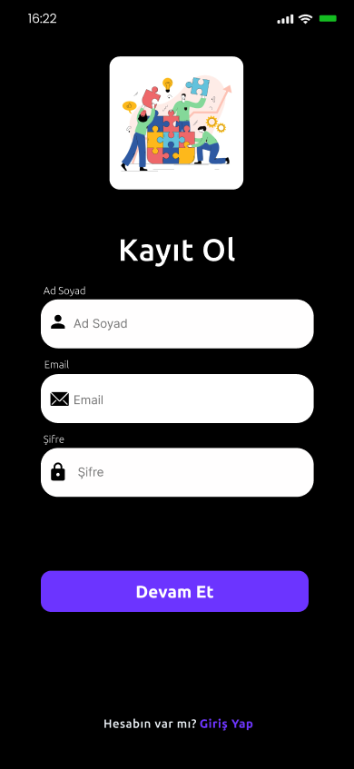</td>
      <td style="width: 25%;">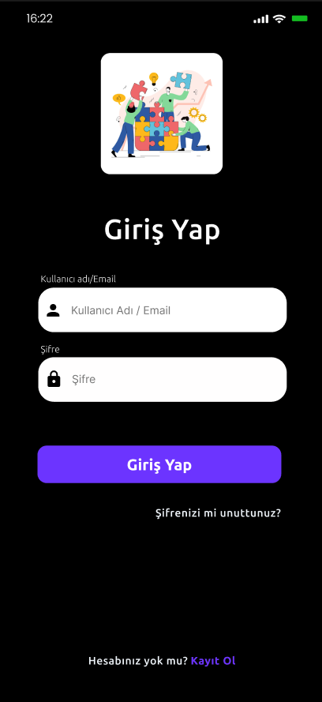</td>
      <td style="width: 25%;">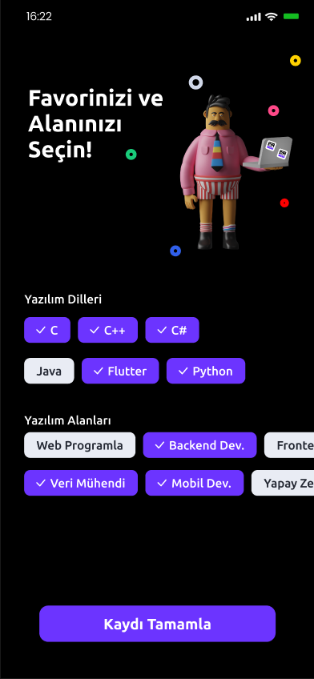</td>
    </tr>
    <tr>
      <td colspan="4" style="text-align: center;"><h2>Ana Ekranlar</h2></td>
    </tr>
    <tr>
      <td style="width: 25%;">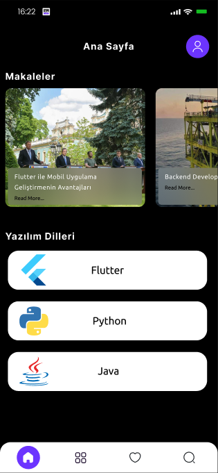</td>
      <td style="width: 25%;">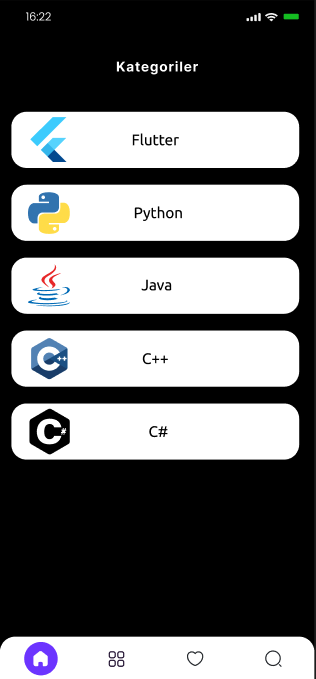</td>
      <td style="width: 25%;">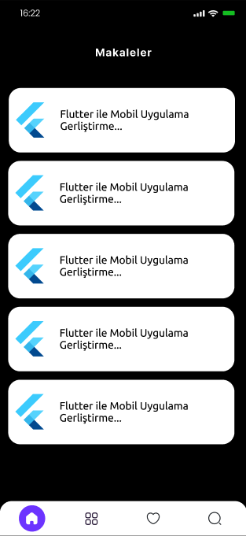</td>
    </tr>
    <tr>
      <td colspan="4" style="text-align: center;"><h2>Profil Ekranı</h2></td>
    </tr>
    <tr>
      <td style="width: 25%;">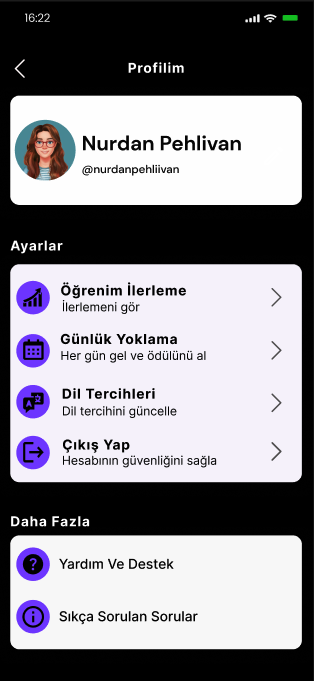</td>
      <td style="width: 25%;"></td>
    </tr>
    <tr>
      <td colspan="4" style="text-align: center;"><h2>Test Ekranları</h2></td>
    </tr>
    <tr>
      <td style="width: 25%;">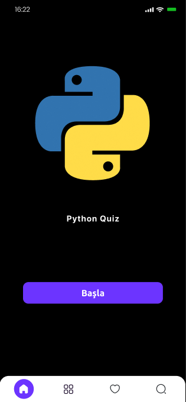</td>
      <td style="width: 25%;">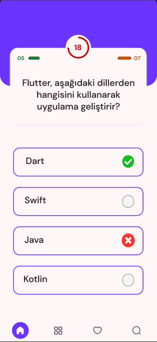</td>
      <td style="width: 25%;"></td>
      <td style="width: 25%;"></td>
    </tr>
  </table>
  
   

  

    
<h3>Sprint 1 - Sprint Trello Güncellemeleri</h3>

    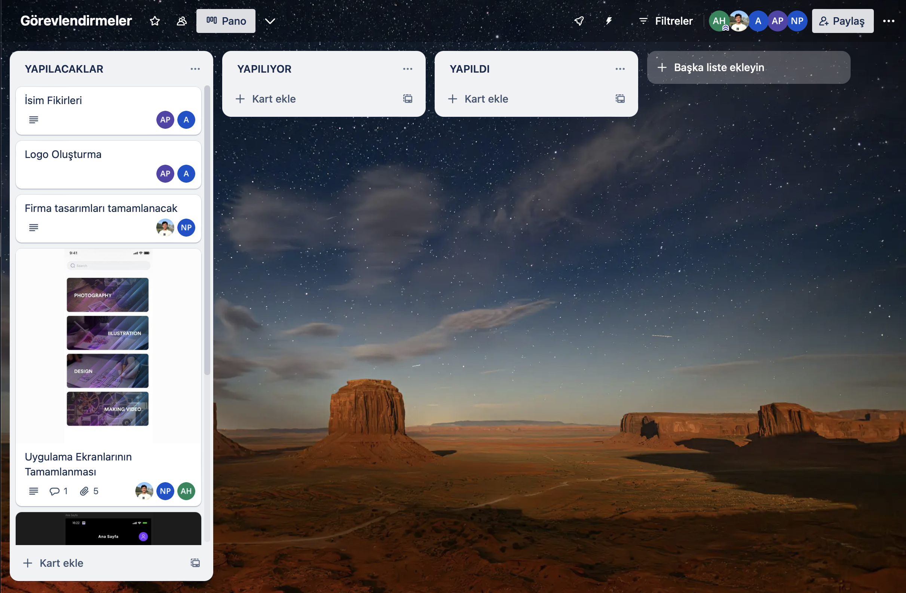
    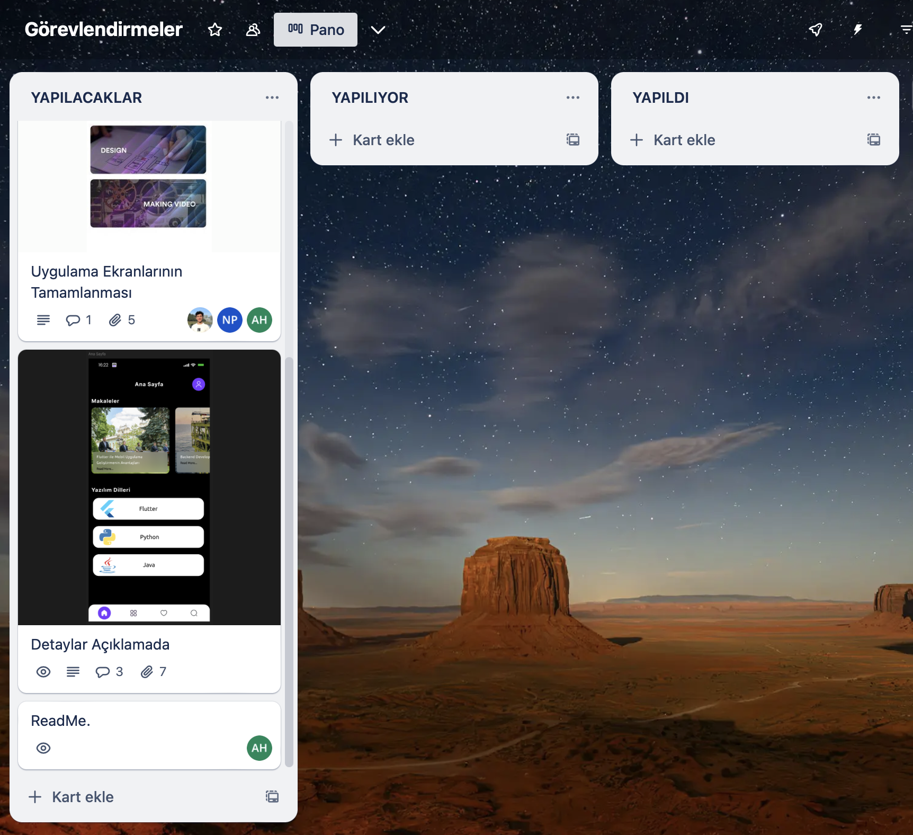
    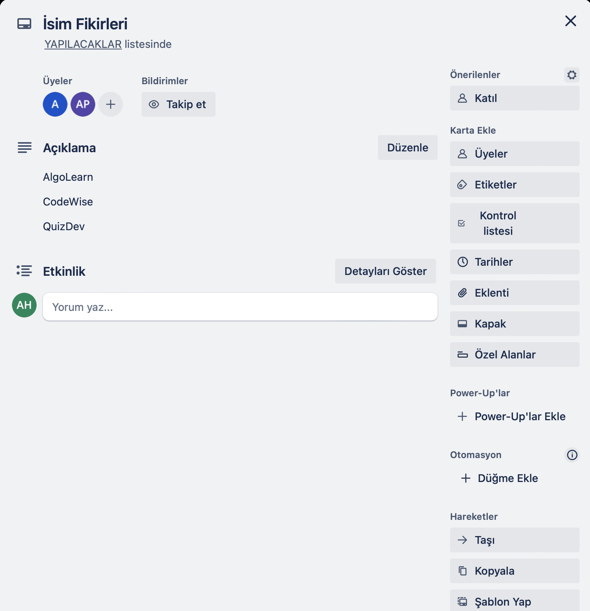
    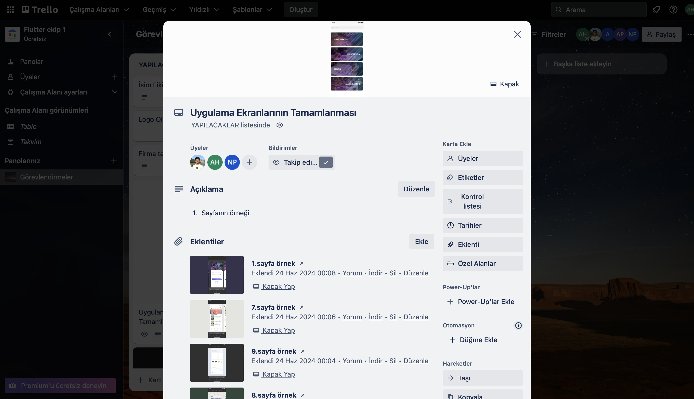
    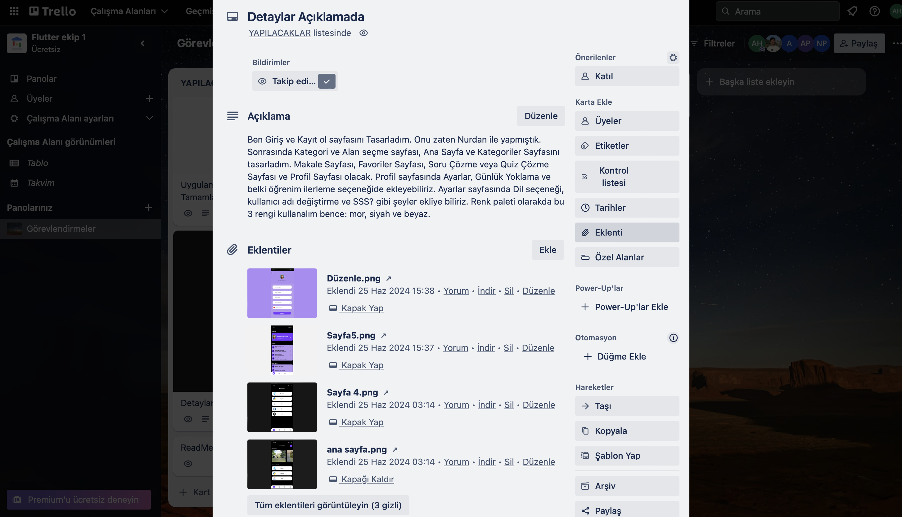
    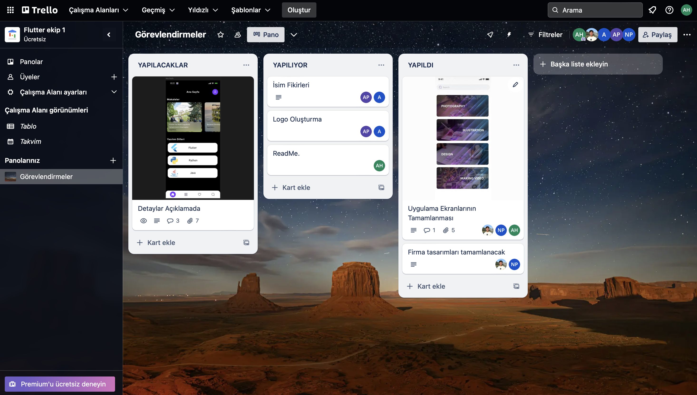
  
"

  - **Sprint Notları**:
    - Proje yönetimi için  `Trello` kullanılması kararlaştırıldı.

    - UI tasarımları için `Figma` kullanılması kararlaştırıldı.

    - Durum yönetimi için `Discord` kullanılması kararlaştırıldı.

    - Giriş sistemi olarak  `email login` kullanılması kararlaştırıldı.

    - Giriş sistemini takiben `identity verification` yapılmasına karar verildi.

  - **Sprint Değerlendirmesi:**
    - Uygulamanın adı üzerinde çalıştık ve 'CodeWise' uygulama isminde karar kıldık

    - Bu sprintte zorlandığımız konulardan biri tasarımdı. Tasarım üzerinde fazla durduk ve biraz zaman kaybettik. Bu yüzden logo üzerine de bir çalışma yapmamıştık. Bu konuda da biraz gecikme yaşandı.

    - Genel olarak güzel bir sprint geçirdik.

  - **Sprint Review Participants:** `Adem Han`, `Nurdan Pehlivan`, `Abdullah Bahromov`, `Aleyna Parkaz`, `Abdüssamed Güldal`

---

    
<h1>Sprint 2</h1>

  

    
<h3>Sprint 1 - Uygulama Ekran Tasarımları</h3>

  <table style="width: 100%;">
    <tr>
      <td colspan="4" style="text-align: center;"><h2>Kayıt ve Giriş Ekranları</h2></td>
    </tr>
    <tr>
      <td style="width: 25%;"></td>
      <td style="width: 25%;"></td>
      <td style="width: 25%;"></td>
      <td style="width: 25%;"></td>
    </tr>
    <tr>
      <td colspan="4" style="text-align: center;"><h2>Ana Ekranlar</h2></td>
    </tr>
    <tr>
      <td style="width: 25%;"></td>
      <td style="width: 25%;"></td>
      <td style="width: 25%;"></td>
    </tr>
    <tr>
      <td colspan="4" style="text-align: center;"><h2>Profil Ekranı</h2></td>
    </tr>
    <tr>
      <td style="width: 25%;"></td>
      <td style="width: 25%;"></td>
    </tr>
    <tr>
      <td colspan="4" style="text-align: center;"><h2>Test Ekranları</h2></td>
    </tr>
    <tr>
      <td style="width: 25%;"></td>
      <td style="width: 25%;"></td>
      <td style="width: 25%;"></td>
      <td style="width: 25%;"></td>
    </tr>
  </table>
  
   

  

    
<h3>Sprint 1 - Sprint Trello Güncellemeleri</h3>

    
    
    
    
    
    
  
"

  - **Sprint Notları**:
    - Proje yönetimi için  `Trello` kullanılması kararlaştırıldı.

    - UI tasarımları için `Figma` kullanılması kararlaştırıldı.

    - Durum yönetimi için `Discord` kullanılması kararlaştırıldı.

    - Giriş sistemi olarak  `email login` kullanılması kararlaştırıldı.

    - Giriş sistemini takiben `identity verification` yapılmasına karar verildi.

  - **Sprint Değerlendirmesi:**
    - Uygulamanın adı üzerinde çalıştık ve 'CodeWise' uygulama isminde karar kıldık

    - Bu sprintte zorlandığımız konulardan biri tasarımdı. Tasarım üzerinde fazla durduk ve biraz zaman kaybettik. Bu yüzden logo üzerine de bir çalışma yapmamıştık. Bu konuda da biraz gecikme yaşandı.

    - Genel olarak güzel bir sprint geçirdik.

  - **Sprint Review Participants:** `Adem Han`, `Nurdan Pehlivan`, `Abdullah Bahromov`, `Aleyna Parkaz`, `Abdüssamed Güldal`

  ---

    --- 

  

    
<h1>Sprint 3</h1>

  

    
<h3>Sprint 1 - Uygulama Ekran Tasarımları</h3>

  <table style="width: 100%;">
    <tr>
      <td colspan="4" style="text-align: center;"><h2>Kayıt ve Giriş Ekranları</h2></td>
    </tr>
    <tr>
      <td style="width: 25%;"></td>
      <td style="width: 25%;"></td>
      <td style="width: 25%;"></td>
      <td style="width: 25%;"></td>
    </tr>
    <tr>
      <td colspan="4" style="text-align: center;"><h2>Ana Ekranlar</h2></td>
    </tr>
    <tr>
      <td style="width: 25%;"></td>
      <td style="width: 25%;"></td>
      <td style="width: 25%;"></td>
    </tr>
    <tr>
      <td colspan="4" style="text-align: center;"><h2>Profil Ekranı</h2></td>
    </tr>
    <tr>
      <td style="width: 25%;"></td>
      <td style="width: 25%;"></td>
    </tr>
    <tr>
      <td colspan="4" style="text-align: center;"><h2>Test Ekranları</h2></td>
    </tr>
    <tr>
      <td style="width: 25%;"></td>
      <td style="width: 25%;"></td>
      <td style="width: 25%;"></td>
      <td style="width: 25%;"></td>
    </tr>
  </table>
  
   

  

    
<h3>Sprint 1 - Sprint Trello Güncellemeleri</h3>

    
    
    
    
    
    
  
"

  - **Sprint Notları**:
    - Proje yönetimi için  `Trello` kullanılması kararlaştırıldı.

    - UI tasarımları için `Figma` kullanılması kararlaştırıldı.

    - Durum yönetimi için `Discord` kullanılması kararlaştırıldı.

    - Giriş sistemi olarak  `email login` kullanılması kararlaştırıldı.

    - Giriş sistemini takiben `identity verification` yapılmasına karar verildi.

  - **Sprint Değerlendirmesi:**
    - Uygulamanın adı üzerinde çalıştık ve 'CodeWise' uygulama isminde karar kıldık

    - Bu sprintte zorlandığımız konulardan biri tasarımdı. Tasarım üzerinde fazla durduk ve biraz zaman kaybettik. Bu yüzden logo üzerine de bir çalışma yapmamıştık. Bu konuda da biraz gecikme yaşandı.

    - Genel olarak güzel bir sprint geçirdik.

  - **Sprint Review Participants:** `Adem Han`, `Nurdan Pehlivan`, `Abdullah Bahromov`, `Aleyna Parkaz`, `Abdüssamed Güldal`

---

  </body>
  </html>

